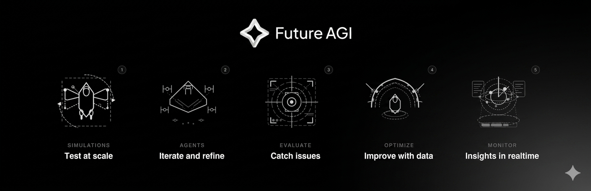

  

  Future AGI is an open-source e2e agent engineering and optimization platform that helps you ship self-improving AI agents.

  <a href="https://app.futureagi.com/auth/jwt/register"><strong>Try Cloud</strong></a> ·
  <a href="https://github.com/future-agi/future-agi"><strong>Self-host</strong></a> ·
  <a href="https://docs.futureagi.com"><strong>Docs</strong></a> ·
  <a href="https://futureagi.com/blog"><strong>Blog</strong></a> ·
  <a href="https://discord.gg/n2tCUKBkAw"><strong>Discord</strong></a>

  
  
  

---

## Why Future AGI

Most AI agents fail in production, and teams end up stitching together evals, observability, and guardrails that never close the loop. Future AGI collapses all of it into one platform: simulate edge cases before launch, evaluate what happens in production, protect users in real time, and feed every trace back into the next version.

## What you get

- 🧪 **Simulate:** thousands of multi-turn text + voice conversations against realistic personas and adversarial inputs
- 📊 **Evaluate:** 50+ metrics under one `evaluate()` call (groundedness, tool-use, PII, custom rubrics)
- 🛡️ **Protect:** 18 built-in guardrails + 15 vendor adapters, inline or standalone
- 👁️ **Monitor:** OpenTelemetry-native tracing across 50+ frameworks (LangChain, LlamaIndex, CrewAI, DSPy…)
- 🎛️ **Agent Command Center:** OpenAI-compatible gateway, 100+ providers, 15 routing strategies
- 🔁 **Optimize:** 6 prompt-optimization algorithms (GEPA, PromptWizard, ProTeGi…) that learn from production

---

## Our repos

| Repo | Install | Purpose |
|---|---|---|
| [**future-agi**](https://github.com/future-agi/future-agi) | `docker compose up -d` | Main monorepo, full self-hostable platform |
| [**traceAI**](https://github.com/future-agi/traceAI) | `pip install fi-instrumentation-otel` | Zero-config OTel tracing for 50+ AI frameworks |
| [**ai-evaluation**](https://github.com/future-agi/ai-evaluation) | `pip install ai-evaluation` | 50+ evaluation metrics + guardrail scanners |
| [**agent-opt**](https://github.com/future-agi/agent-opt) | `pip install agent-opt` | 6 prompt-optimization algorithms |
| [**simulate-sdk**](https://github.com/future-agi/simulate-sdk) | `pip install agent-simulate` | Voice-agent simulation (LiveKit + Silero VAD) |
| [**agentcc**](https://github.com/future-agi/agent-command-center-sdk) | `pip install agentcc` | Gateway client, 100+ LLM providers |

See [all repos →](https://github.com/orgs/future-agi/repositories)

---

## Community & company

- 💬 [**Discord**](https://discord.gg/n2tCUKBkAw) · 🗨️ [**Discussions**](https://github.com/orgs/future-agi/discussions) · 📝 [**Blog**](https://futureagi.com/blog) · 📺 [**YouTube**](https://www.youtube.com/@Future_AGI)
- 🧑‍💻 **We're hiring** → [futureagi.com/careers](https://futureagi.com/careers)
- 📬 **Reach us** → [hello@futureagi.com](mailto:hello@futureagi.com)

  Apache 2.0 · Built by the Future AGI team and <a href="https://github.com/future-agi/future-agi/graphs/contributors">contributors worldwide</a>

